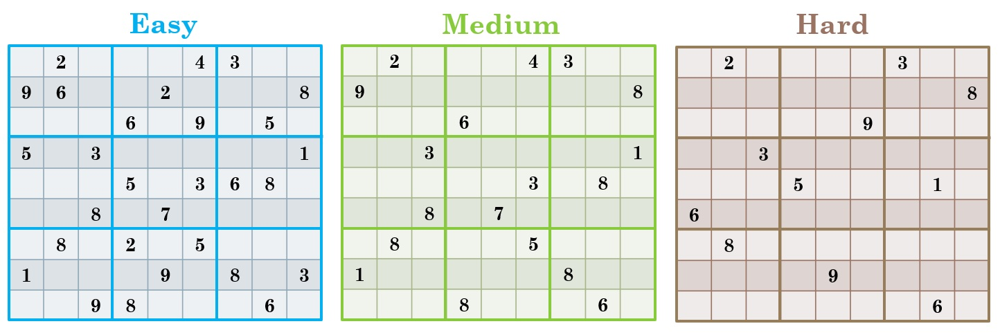

# Sudoku
## Rules of the game
A sudoku is a 9*9 grid, it solved when all grid cells have been filled with numbers from 1 to 9 according to the following rules:
- Each row and column must contain numbers 1-9 (once only)
- Each 3*3 must contain numbers 1-9 (also once only)

## Pre-generate the game
- Some cells will be pre-filled 
- The number of these cells depend on difficulty (easy, medium or hard)

## Algorithm
1. Check if the rows and columns contain values 1-9, without repetition.
2. Check if each of the 9 sub-squares contains values 1-9, without repetition.
3. If the previous two conditions are true then the Sudoku board is valid; otherwise, it is invalid.

## Technologies used and structure
HTML, CSS, JavaScript and jQuery using Visual Studio Code.

HTML pages: 
- landing page (index.html) contains information and rules of the game and three options to start and play 
- (level1.html, level2.html, level3.html) difficulty pages: easy, medium and hard
- CSS file (style.css) control the style of the HTML pages

(script.js) contains JavaScript and jQuery functions that run website

Images folder contains background picture and some screenshots

## Approach
First, building HTML then CSS after that start writing functions in javaScript, I start with a function that take numbers from board and store them in 2D array (9*9) after that build a function to check the 2D array just contains numbers 1-9.
And as I mentioned before ckeck every row, colum and sub-square to make sure no repeated numbers, all these functions are boolean and if all are true the puzzel is solved.

## Getting Started
After choosing a level you will see a board with empty cells and some of them have numbers, as shown in below screen shot

You have to fill all empty cells following previous rules if you feel need help you can click 'Hint' button but there are only five hints. 
If you want to calculate the time spent solving the puzzel just click the 'start' button on the timer side.

After filling all cells just click 'Check' button and then will receive a message whether the solution right or not.

### Demo

[Demo](https://pages.git.generalassemb.ly/meznah/project-1/index.html)
